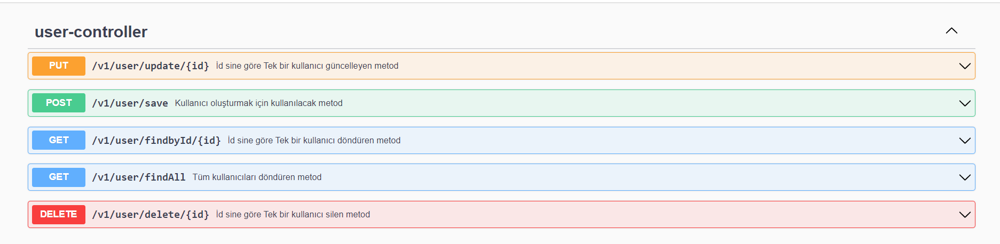

# FT Teknoloji Java Spring Practicum First Case

### Entity Sınıflarımız

* [User]
* [Product]
* [ProductComment]

### Dto Sınıflarımız

* [UserRequest]
* [ProductRequest]
* [ProductCommentRequest]
* [ProductCommentUpdateRequest]

### End Pointler

     Version değerimiz
     VERSION = "/v1";

     Her bir entitye ait url  
     
     USER = "/user";
     PRODUCT = "/product";
     COMMENT = "/comment";

   
     * GENEL olarak tanımlanan isteklerin burada tanımlayalım
   
     SAVE= "/save";
     UPDATE= "/update/{id}";
     DELETE= "/delete/{id}";
     FINDALL= "/findAll";
     FINDBYID= "/findbyId/{id}";

     * CONTROLLER için özel olarak tanımladığınız end pointler
    

     *PoductController

     GETBYEXPIRATIONDATEBEFORE= "/expirationDateBefore"; ( son kullanma tarihi geçmiş ürünler)
     GETBYEXPIRATIONDATEAFTERORNULL= "/expirationDateAfter"( son kullanma tarihi geçmemiş ve null olan ürünler);

    
     * PoductCommentController
      
     GETBYPRODUCTID= "/getbyProductId/{productId}";
     GETBYUSERID= "/getByUserId/{userid}";
     GETBYCOMMENTDATE= "/getByCommentDate/{start}/{finish}";
     GETBYCOMMENTDATEANDUSERID= "/getByCommentDateAndUserId/{start}/{finish}/{userid}";
     
     
     
     
     

     
     

     
     

